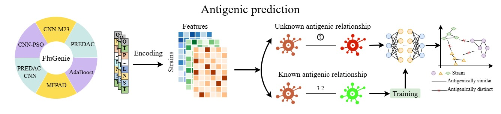

# FluGenie-methodbox
*FluGenie: Accurate sequence-based antigenicity prediction and antigenic variant detection for influenza viruses.*

FluGenie enables accurate sequence-based antigenicity prediction and antigenic variant detection for influenza viruses.
 

---

## Introduction

Accurate sequence-based models have the potential to enable extensive antigenic surveillance of circulating viral isolates while reducing the need for extensive experimental efforts. 
This repository provides **open-source implementations** of six sequence-based methods for predicting antigenicity:

- **PREDAC** [1]
- **CNN-PSO** [2]
- **CNN-M23** [3]
- **MFPAD** [4]
- **PREDAC-CNN** [5]
- **AdaBoost** [6]

These methods are implemented to allow **easy testing** with your own influenza HA1 sequence data.

---

## Installation

Clone this repository:

```bash
git clone https://github.com/xingyili/FluGenie-methodbox.git
cd FluGenie-methodbox
```

Install the required core dependencies (preferably in a virtual environment):

- `python` 3.10.13
- `biopython` 1.84
- `joblib` 1.4.2
- `pandas` 2.2.2
- `numpy` 1.26.1
- `scikit-learn` 1.7.0
- `scipy` 1.15.3
- `torch` 1.11.0+cu113
- `tqdm` 4.66.1
- `xgboost` 2.0.3

## **Demo: Running Each Method**

Below are example commands for running the six methods. Replace the example input files with your own HA1 sequence file (`--seq_path`) and corresponding antigenicity/HI data (`--anti_path`) as needed.

### **1. PREDAC**

```bash
python src/PREDAC/main.py --seq_path demo_data/demo_HA1.csv --anti_path demo_data/demo_HI.csv --subtype H3 --label NAD_class
```

### **2. CNN-PSO**

```bash
python src/CNN-PSO/main.py --seq_path demo_data/demo_HA1.csv --anti_path demo_data/demo_HI.csv --subtype H3 --label NAD_class
```

### **3. CNN-M23**

```bash
python src/CNN-M23/main.py --seq_path demo_data/demo_HA1.csv --anti_path demo_data/demo_HI.csv --subtype H3 --label NAD_distance
```

### **4. MFPAD**

```bash
python src/MFPAD/main.py --seq_path demo_data/demo_HA1.csv --anti_path demo_data/demo_HI.csv --subtype H3 --label NAD_distance
```

### **5. PREDAC-CNN**

```bash
python src/PREDAC-CNN/main.py --seq_path demo_data/demo_HA1.csv --anti_path demo_data/demo_HI.csv --subtype H3 --label NAD_class
```

### **6. AdaBoost**

```bash
python src/AdaBoost/main.py --seq_path demo_data/demo_HA1.csv --anti_path demo_data/demo_HI.csv --subtype H3 --label NAD_distance
```

## **Output**

All methods will generate prediction results based on the trained models

## **References**

[1] Du X, Dong L, Lan Y, et al. Mapping of H3N2 influenza antigenic evolution in China reveals a strategy for vaccine strain recommendation[J]. Nature communications, 2012, 3(1): 709.

[2] Lee E K, Tian H, Nakaya H I. Antigenicity prediction and vaccine recommendation of human influenza virus A (H3N2) using convolutional neural networks[J]. Human Vaccines & Immunotherapeutics, 2020, 16(11): 2690-2708.

[3] Forghani M, Khachay M. Convolutional neural network based approach to in silico non-anticipating prediction of antigenic distance for influenza virus[J]. Viruses, 2020, 12(9): 1019.

[4] Li X, Li Y, Shang X, et al. A sequence-based machine learning model for predicting antigenic distance for H3N2 influenza virus[J]. Frontiers in Microbiology, 2024, 15: 1345794.

[5] Meng J, Liu J, Song W, et al. PREDAC-CNN: predicting antigenic clusters of seasonal influenza A viruses with convolutional neural network[J]. Briefings in Bioinformatics, 2024, 25(2): bbae033.

[6] Shah S A W, Palomar D P, Barr I, et al. Seasonal antigenic prediction of influenza A H3N2 using machine learning[J]. Nature Communications, 2024, 15(1): 3833.